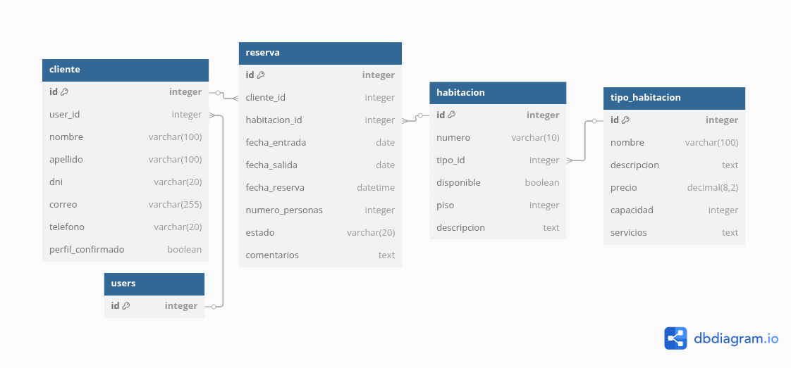

# Sistema Web para la Gestión de Reservas de Hotel

**Repositorio GitHub:** [https://github.com/ionjpgDev/ProyectoWeb](https://github.com/ionjpgDev/ProyectoWeb)

**Video demostrativo:** [Enlace a Google Drive](Pega_aquí_el_enlace_del_video_cuando_lo_tengas)

## Descripción

Este proyecto consiste en un sistema web desarrollado para la gestión integral de reservas en un hotel. Permite la administración eficiente de habitaciones, clientes y reservas, facilitando tanto la operatividad interna como la experiencia del usuario.

## Objetivo del Proyecto

Desarrollar una aplicación web que permita a los administradores gestionar reservas, habitaciones y clientes de manera eficiente, asegurando la integridad de los datos y facilitando el acceso a la información relevante.

## Funcionalidades principales

- Registro y autenticación de usuarios.
- Gestión de habitacione.
- Gestión de clientes.
- Creación, edición y cancelación de reservas.
- Visualización de disponibilidad.
- Panel de administración para seguimiento y reportes.

---

## 1. Requisitos

Para ejecutar correctamente este proyecto, es necesario contar con los siguientes requisitos de software y librerías:

### 1.1. Lenguaje y Framework Principal

- **Python 3.x:** Se recomienda utilizar una versión igual o superior a Python 3.8 para asegurar la compatibilidad con todas las dependencias.
- **Django:** Framework principal del proyecto. Se recomienda Django versión 3.x o superior para aprovechar mejoras de seguridad y soporte a largo plazo.

### 1.2. Librerías Adicionales

Además de Django, el proyecto requiere la instalación de las siguientes librerías adicionales, detalladas en el archivo `requirements.txt`:

- **django-crispy-forms:** Permite mejorar y personalizar la presentación de formularios en las plantillas HTML.
- **Pillow:** Librería de procesamiento de imágenes utilizada por Django para el manejo de archivos gráficos (por ejemplo, fotos de habitaciones o usuarios).
- **django-widget-tweaks:** Facilita la personalización avanzada de widgets de formularios directamente en las plantillas.
- **pytest-django:** (Opcional) Herramienta de testing para pruebas automatizadas sobre el proyecto Django.
- **python-dotenv:** (Opcional) Permite cargar variables de entorno desde archivos `.env` para una configuración más flexible y segura.
- **Otros:** Dependiendo de las necesidades y extensiones del proyecto, pueden requerirse otras librerías adicionales. Todas las dependencias están especificadas en el archivo `requirements.txt` incluido en el repositorio.

### 1.3. Navegador Web

- Un navegador web moderno y actualizado (Google Chrome, Mozilla Firefox, Microsoft Edge, Safari, etc.).

### 1.4. Sistemas Operativos Compatibles

- Windows 10 o superior
- Linux (Ubuntu, Debian, Fedora, etc.)
- macOS

**Nota:**  
Antes de la instalación, se recomienda actualizar el gestor de paquetes `pip`:

```bash
python -m pip install --upgrade pip
```

## 2. Instalación y estructura de archivos

### Instalación

1. Clona este repositorio:

   ```bash
   git clone https://github.com/ionjpgDev/ProyectoWeb.git
   cd ProyectoWeb
   ```

2. Crea un entorno virtual e instálalo:

   ```bash
   python -m venv env
   source env/bin/activate  # Windows: env\Scripts\activate
   pip install -r requirements.txt
   ```

3. Realiza las migraciones y ejecuta el servidor:

   ```bash
   python manage.py migrate
   python manage.py runserver
   ```

## Estructura de Archivos del Proyecto y Descripción de Carpetas

A continuación se muestra la estructura principal del proyecto y una breve descripción de la función de cada carpeta y archivo relevante.

```
ProyectoWeb/
├── manage.py
├── requirements.txt
├── README.md
├── db.sqlite3
├── app_reservas/
│   ├── __init__.py
│   ├── admin.py
│   ├── apps.py
│   ├── forms.py
│   ├── migrations/
│   ├── models.py
│   ├── tests.py
│   ├── urls.py
│   ├── views.py
│   ├── templates/
│   │   └── app_reservas/
│   │        ├── base.html
│   │        ├── index.html
│   │        └── ...
│   └── static/
│        └── app_reservas/
│            ├── css/
│            ├── js/
│            └── images/
├── ProyectoWeb/
│   ├── __init__.py
│   ├── asgi.py
│   ├── settings.py
│   ├── urls.py
│   └── wsgi.py
└── static/
```

### Descripción de Carpetas y Archivos Principales

- **manage.py**: Script principal para ejecutar comandos de Django (servidor, migraciones, superusuario, etc.).
- **requirements.txt**: Lista de todas las dependencias y librerías necesarias para el proyecto.
- **README.md**: Archivo de documentación principal del proyecto.
- **db.sqlite3**: Archivo de base de datos SQLite generado automáticamente (no incluir en el repositorio si se usa otra BD).
- **app_reservas/**: Aplicación principal de Django que contiene la lógica de negocio del sistema de reservas.
  - **admin.py**: Configuración de la administración del sitio para modelos personalizados.
  - **apps.py**: Configuración de la aplicación Django.
  - **forms.py**: Definición de formularios personalizados usados en la web.
  - **migrations/**: Archivos de migración de la base de datos (generados automáticamente por Django).
  - **models.py**: Definición de los modelos de la base de datos (Habitaciones, Reservas, Clientes, etc.).
  - **tests.py**: Pruebas automatizadas para la aplicación.
  - **urls.py**: Rutas específicas de la aplicación de reservas.
  - **views.py**: Lógica de las vistas (controladores) de la aplicación.
  - **templates/app_reservas/**: Plantillas HTML para la interfaz web de la aplicación.
    - **base.html, index.html, ...**: Diferentes vistas/páginas del sistema.
  - **static/app_reservas/**: Archivos estáticos propios de la app (CSS, JavaScript, imágenes).
- **ProyectoWeb/**: Configuración global del proyecto Django.
  - **settings.py**: Configuración principal del proyecto (BD, apps instaladas, seguridad, etc.).
  - **urls.py**: Enrutamiento global del proyecto.
  - **asgi.py / wsgi.py**: Entradas para servidores ASGI/WSGI.
- **static/**: Carpeta global de archivos estáticos comunes a todo el proyecto (puede incluir CSS, JS, imágenes compartidas).


## 3. Modelo de Datos

### Diagrama Entidad-Relación


